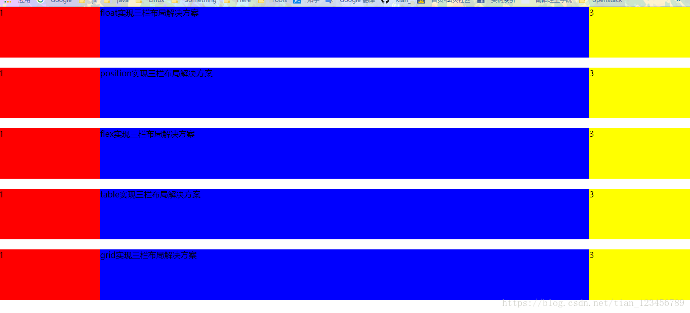

:::tip
该博客主要介绍的是通过css实现三栏布局的几种方案
:::
<!-- more -->

### 通过浮动实现三栏布局

```js
<section>
		<style type="text/css">
			.float-layout div{
				height: 100px;

			}
			.float-layout .left{
				float: left;
				width: 200px;
				background-color: red;
			}
			.float-layout .right{
				float: right;
				width: 200px;
				background-color: yellow;
			}
			.float-layout .center{
				margin:0 200px;
				background-color: blue;
			}
		</style>
		<article class="float-layout">
			<div class="left">1</div>
			<div class="right">3</div>
			<div class="center">float实现三栏布局解决方案</div>

		</article>
	</section>
```


----------


### 通过定位实现三栏布局

```js
<section>
		<style type="text/css">
				.position-layout div{
					height: 100px;
					margin-top: 20px;//是为了和上面的有一定的间距

				}
				.position-layout .left{
					position: absolute;
					top: 100px;
					left: 0px;
					width: 200px;
					background-color: red;
				}
				
				.position-layout .center{
					margin: 0 200px;
					margin-top: 20px;
					background-color: blue;
				}
				.position-layout .right{
					position: absolute;
					top: 100px;
					right:0px;
					width: 200px;
					background-color: yellow;
				}
		</style>
		<article class="position-layout">
			<div class="left">1</div>
			<div class="center">position实现三栏布局解决方案</div>
			<div class="right">3</div>
		</article>
	</section>

```


----------


### 通过flex实现三栏布局

```js
<section>
		<style type="text/css">
			.flex-layout{
				display: flex;
				height: 100px;
				margin-top: 20px;
			}
			.flex-layout .left{
				width: 200px;
				background-color: red;

			}
			.flex-layout .center{
				flex: 1;
				background-color: blue;
			}
			.flex-layout .right{
				width: 200px;
				background-color: yellow;
			}
		</style>
		<article class="flex-layout">
			<div class="left">1</div>
			<div class="center">flex实现三栏布局解决方案</div>
			<div class="right">3</div>
		</article>
	</section>

```


----------

### 通过table实现三栏布局

```js
<section>
		<style type="text/css">
			.table-layout{
				display: table;
				width: 100%;
				margin-top: 20px;
			}
			.table-layout>div{
				display: table-cell;
				height: 100px;

			}
			.table-layout .left{
				width: 200px;
				background-color: red;
			}
			.table-layout .right{
				width: 200px;
				background-color: yellow;
			}
			.table-layout .center{
				background-color: blue;
			}
		</style>
		<article class="table-layout">
			<div class="left">1</div>
			<div class="center">table实现三栏布局解决方案</div>
			<div class="right">3</div>
		</article>
	</section>
```


----------

### 通过grid实现三栏布局

```js
<section>
		<style type="text/css">
			.grid-layout{
				display: grid;
				grid-template-columns: 200px auto 200px;
				height: 100px;
				margin-top: 20px;	
			}
			.grid-layout .left{
				background-color: red;
			}
			.grid-layout .center{
				background-color: blue;
			}
			.grid-layout .right{
				background-color: yellow;
			}
		</style>
		<article class="grid-layout">
			<div class="left">1</div>
			<div class="center">grid实现三栏布局解决方案</div>
			<div class="right">3</div>
		</article>
	</section>
```
实例图片如下：
