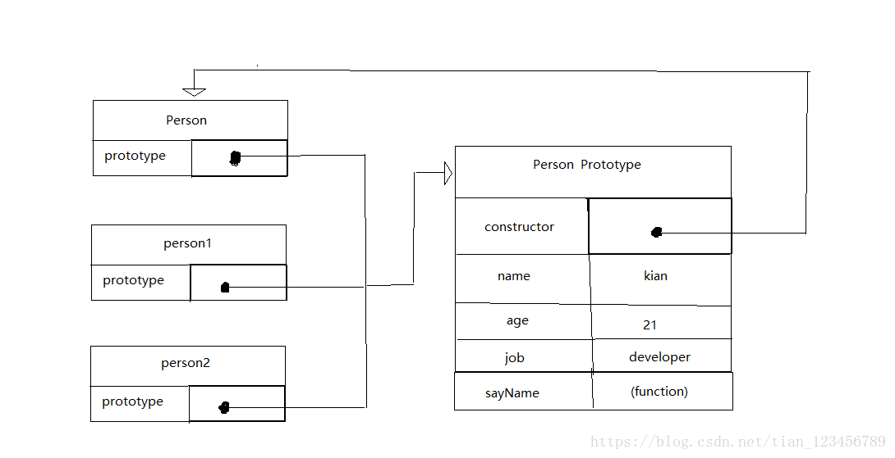

### 工厂模式
 > 这种模式抽象了创建具体对象的过程，使用同一个接口可以创建很多对象，减少大量的重复代码。
 
```js
	function createPerson(name, age, job){
		var o = new Object();
		o.name = name;
		o.age = age;
		o.job = job;
		o.sayName = function(){
			console.log(this.name);
		};
		return o;
	}

	var person1 = createPerson("Tom", 20, "Software programmer");
	var person2 = createPerson("Jack", 18, "Student"); 
```

### 构造函数模式
>  工厂模式虽然解决了创建多个相似对象的问题，但却没有解决对象识别的问题，为了解决这个问题，soga 构造函数模式出现。
```js
	function Person(name, age, job){
		this.name = name;
		this.age = age;
		this.job = job;
		this.sayName = function(){
			console.log(this.name);
		};
	}

	var person1 = new Person("Tom", 21, "Software Engineer");
	var person2 = new Person("Jack", 19, "Student");
```

要创建Person的新实例，必须使用new操作符。以这种方式调用构造函数实际上会经历一下4个步骤：

 -  创建一个新对象
 -  将构造函数的作用域赋给新对象（this指向这个新对象）
 -  执行构造函数中的代码（为这个新对象添加属性）
 -  返回新对象
 最后这两个对象的构造函数属性（constructor）都指向Person，并且都是Person对象类型

 ```js
	console.log(person1.constructor == Person) //true
	console.log(person2.constructor == Person) //true
	
	console.log(person1 instanceof Person) //true
	console.log(person2 instanceof Person) //true

 ```
### 原型模式
>  构造函数虽然好用，但是构造函数中的每个方法都要在每个实例上重新创建一遍。如上person1和person2都有一个sayName()的函数，因此每定义一个函数，就实例化了一个对象(在JavaScript中函数就是对象)。为了解决这个问题，所以又有了原型模式。 （写个代码考虑的问题真多，emmmmp....）

```js
	function Person(){
	}
	
	Person.prototype.name = "Kian";
	Person.prototype.age = 21;
	Person.prototype.job = "developer";
	Person.prototype.sayName = function(){
		console.log(this.name);
	};
	
	var person1 = new Person();
	person1.sayName(); //Kian
	var person2 = new Person();
	person2.sayName(); //kian
	console.log(person1.sayName == person2.sayName) //true
```
一说到原型就要讲关于原型链的内容，但是原型链我不会，好，讲的好，原型链讲解结束( mmp, 啥也没讲....)

但是还是画一张图吧，手动草图，溜~

### 组合使用构造函数模式和原型模式
> 该模式中，构造函数模式用来定义实例属性，而原型模式用来定义方法和共享的属性。这样每个实例搜会有自己的一份实例属性的副本，但同时有共享着对方法的引用，最大程度的节省了内存。（一群编程狂魔的自娱自乐....）

```js
	function Person(name, age, job){
		this.name = name;
		this.age = age;
		this.job = job;
		this.friends = ['Kian',"Tone"]
	}

	Person.prototype = {
		constructor: Person,
		sayName: function(){
			console.log(this.name);
		}
	}

	var person1 = new Person("Tom", 22, "Software Manager");
	var person2 = new Person("Jack", 20, "Student")

	person1.firends.push("Mary");
	
	console.log(person1.friends); //"Kian, Tone, Mary"
	console.log(person2.fridens); //"Kian, Tone"
	console.log(person1.friends === person2.friends); //false
	console.log(person1.sayName === person2.sayName); //true
```
### 动态原型模式
> 该设计模式是为了解决没有其他OO语言经验的开发人员更好的理解独立的原型和和构造函数，该设计模式把所有信息都封装在构造函数中，而通过构造函数中初始化原型，又保持了同时使用构造函数和原型的优点。 （mmp,没有经验还学，照顾的真到位...）

```js
	function Person(name, age, job){
		this.name = name;
		this.age = age;
		this.job = job;
		
		if(typeof this.sayName != "function"){
			Person.prototype.sayName = function(){
				console.log(this.name);
			};
		}
	}

	var friend = new Person("Kian", 22, "Software developer");
	friend.sayName();
```
### 寄生构造函数模式
>  这种模式的基本思想是创建一个函数，该函数的作用仅仅是封装创建对象的代码，然后再返回新创建的对象。 （这不是明明是工厂模式吗？黑人问号❓❓❓)
```js
	function Person(name, age, job){
		var o = new Object();
		o.name = name;
		o.age = age;
		o.job = job;
		o.sayName = function(){
			console.log(this.name);
		};
		return o;
	}
	
	var friend = new Person("Kian", 23, "Software developer");
	friend.sayName();
```

### 稳妥构造函数模式
>  稳妥构造函数遵循与寄生构造函数类似的设计模式，但有两点不同：一是新创建的对象的实例方法不引用this；二是不适用new操作符调用构造函数。（你们怕是有代码SB综合症吧..... 这和上面的有什么不同，心情复杂）

```js
	function Person(name, age, job){
		var o = new Object();
		o.name = name;
		o.age = age;
		o.job = job;
		o.sayName = function(){
			console.log(this.name);
		};
		return o;
	}

	var friend = Person("Kian", 24, "Software developer");
	friend.sayName();
```