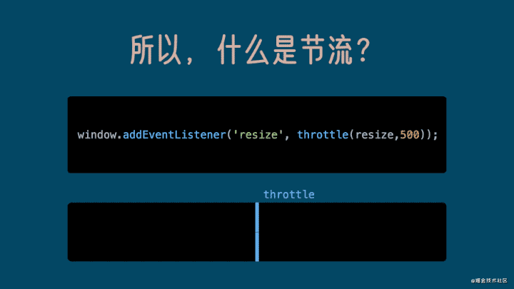
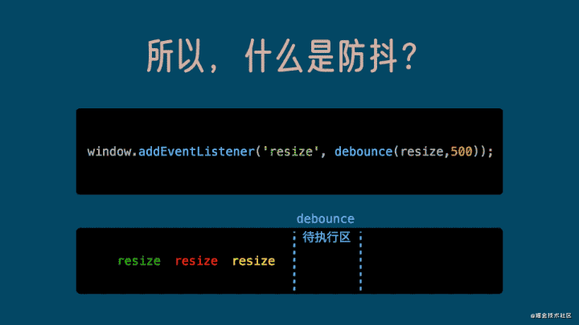

:::tip
介绍节流和防抖的概念和使用场景

:::

<!-- more -->


### 函数节流

> 在一个单位时间段内，只执行一次函数。如果这个单位时间内触发多次函数，只有一次函数执行。

#### 使用场景

- 滚动加载，加载更多或滚到底部监听
- 搜索框，搜索联想功能
- 按钮高频点击提交，表单重复提交


#### 定时器版实现
```js
function throttle(func, delay){
  let timer = null;
  if(timer){
    return ;
  }else{
    func.apply(this, arguments);
    timer = setTimeout(() =>{
      timer = null;
    }, delay)
  }
}

```

#### 时间戳版实现

```js
function throttle(func, delay){
  let last = 0;
  return () =>{
    let new = new Date.now();
    if(now > delay + last){
      func.apply(this, arguments);
      last = now;
    }
  }
}
```


### 函数防抖

> 函数防抖，就是指触发事件后在 n 秒内函数只能执行一次，如果在 n 秒内又触发了事件，则会重新计算函数执行时间。


#### 使用场景

- 搜索框搜索输入。只需用户最后一次输入完，再发送请求
- 手机号、邮箱验证输入检测
- 窗口大小变化。只需窗口调整完成后，计算窗口大小。防止重复渲染。

```js
function debounce(func, delay){
  let timer = null;

  return () =>{
    clearTimeout(timer);
    timer = setTimeout(()=>{
      func.apply(this,arguments)
    }, delay);
  }
}

```

------

#### 参考

- [7分钟理解JS的节流、防抖及使用场景](https://juejin.cn/post/6844903669389885453) 
- [听说前端面试手写”节流防抖“你不会？用动画带你秒懂](https://www.v2ex.com/t/777338) 
- [彻底弄懂函数防抖和函数节流](https://segmentfault.com/a/1190000018445196)