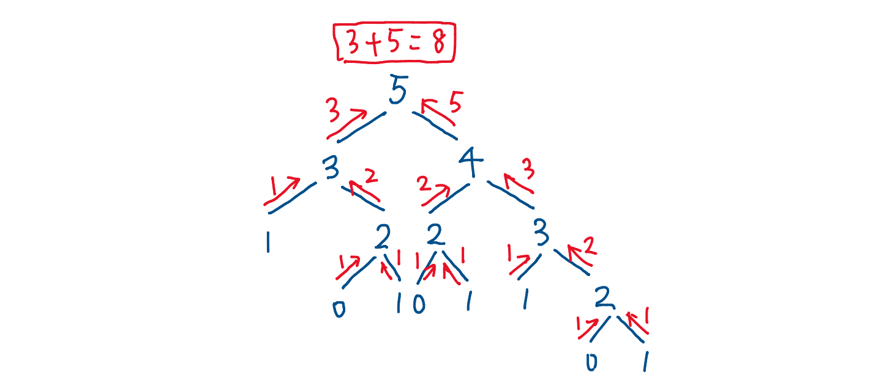

:::tip

[climbing-stairs](https://leetcode-cn.com/problems/climbing-stairs/) 

:::

<!-- more -->

> 假设你正在爬楼梯。需要 n 阶你才能到达楼顶。
>
> 每次你可以爬 1 或 2 个台阶。你有多少种不同的方法可以爬到楼顶呢？


:::tip 注意
给定 n 是一个正整数。
:::
------

#### 示例1
```bash
输入： 2
输出： 2
解释： 有两种方法可以爬到楼顶。
1.  1 阶 + 1 阶
2.  2 阶
```

#### 示例2
```bash
输入： 3
输出： 3
解释： 有三种方法可以爬到楼顶。
1.  1 阶 + 1 阶 + 1 阶
2.  1 阶 + 2 阶
3.  2 阶 + 1 阶
```

### 思路

假设 n = 5，有 5 级楼梯要爬, 每次可以爬 1 或 2 个台阶。

- 如果爬1级，则剩下4级要爬。
- 如果爬2级，则剩下3级要爬。
- 于是，爬 5 级楼梯的方式数 = 爬 4 级楼梯的方式数 + 爬 3 级楼梯的方式数。



```js
var climbStairs = function (n) {
  let sum = [];
  sum[0] = 0;
  sum[1] = 1;
  sum[2] = 2;
  for (let i = 3; i <= n; i++) {
    sum[i] = sum[i - 2] + sum[i - 1];
  }
  return sum[n];
};
```